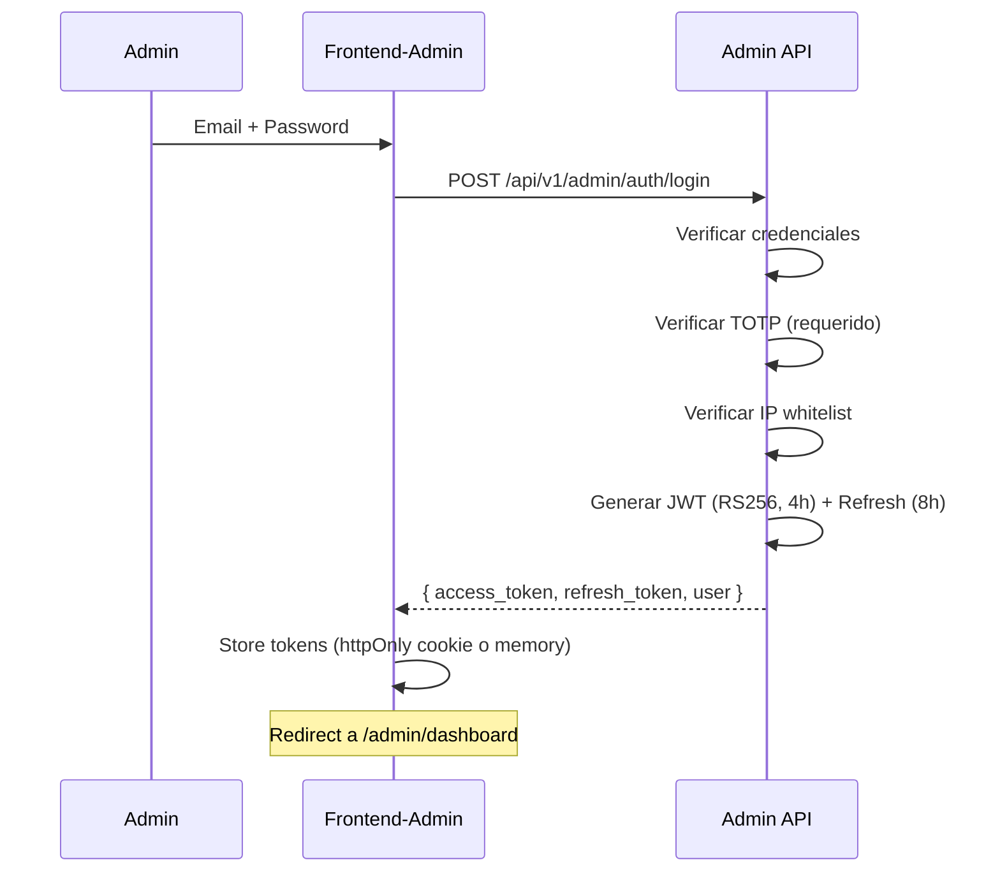

# ESCRIBA — Módulo Administrativo Global
## Documento de Arquitectura v1.0

> **Propósito:** Definir la arquitectura del panel administrativo global del sistema ESCRIBA POS, que permite al equipo interno gestionar todas las empresas clientes, licencias, facturación, soporte y monitoreo del sistema.

---

## Tabla de contenido

1. [Visión general](#1-visión-general)
2. [Principios arquitectónicos](#2-principios-arquitectónicos)
3. [Diagrama de contexto del sistema](#3-diagrama-de-contexto-del-sistema)
4. [Estructura del proyecto](#4-estructura-del-proyecto)
5. [Stack tecnológico](#5-stack-tecnológico)
6. [Modelo de datos (schema public)](#6-modelo-de-datos-schema-public)
7. [Seguridad](#7-seguridad)
8. [Impersonation](#8-impersonation)
9. [API design](#9-api-design)
10. [Plan de implementación](#10-plan-de-implementación)

---

## 1. Visión general

El **Módulo Administrativo Global** es una plataforma SaaS de gestión interna que permite al equipo de ESCRIBA:

- Administrar todas las empresas clientes (tenants)
- Gestionar planes, precios y licencias
- Facturar a las empresas y gestionar cobros
- Configurar feature flags y módulos por empresa
- Dar soporte técnico (tickets)
- Enviar comunicaciones masivas
- Monitorear la salud del sistema
- Auditar todas las acciones del equipo interno

### Separación del sistema

```
┌─────────────────────────────────────────────────────────────────┐
│               PANEL ADMINISTRATIVO (admin.escriba.co)            │
│                     Equipo interno ESCRIBA                        │
│  React 19 + Vite + Tailwind + shadcn/ui (proyecto frontend-admin)│
└──────────────────────────┬──────────────────────────────────────┘
                           │ API REST (JWT RS256)
┌──────────────────────────▼──────────────────────────────────────┐
│        Admin API (backend módulo admin)                          │
│  Spring Boot 3.4 — Controladores: /api/v1/admin/*                │
│  Servicios: Tenants, Plans, Licenses, Invoicing, Support...      │
└──────────────────────────┬──────────────────────────────────────┘
                           │ JDBC
┌──────────────────────────▼──────────────────────────────────────┐
│     PostgreSQL — schema: public (datos de gestión global)        │
│  tenants · plans · licenses · invoices · tickets · audit_logs    │
└──────────────────────────┬──────────────────────────────────────┘
                           │ Lectura controlada
┌──────────────────────────▼──────────────────────────────────────┐
│     Schemas de tenants (datos aislados de cada empresa)          │
│  tenant_empresa_a · tenant_empresa_b (datos de negocio)          │
└─────────────────────────────────────────────────────────────────┘
                           │
┌──────────────────────────▼──────────────────────────────────────┐
│               PANEL CLIENTE (app.escriba.co)                     │
│              Frontend existente + API de empresas                 │
└─────────────────────────────────────────────────────────────────┘
```

---

## 2. Principios arquitectónicos

### 2.1 Separación total
- Ningún usuario del panel de empresas puede acceder al panel admin
- Dominios separados: `admin.escriba.co` vs `app.escriba.co`
- Contenedores Docker independientes
- Base de datos compartida pero con separación lógica (schema `public` para datos admin, schemas `tenant_*` para datos de clientes)

### 2.2 Seguridad máxima
- 2FA (TOTP) obligatorio para todos los usuarios del panel admin
- JWT con RS256 (par de llaves separado del JWT de empresas)
- Sesiones de corta duración: 4h (access token) + 8h (refresh token)
- Bloqueo tras 3 intentos fallidos de login
- IP whitelist por usuario (opcional)
- Rate limiting: 10 req/s en rutas de autenticación

### 2.3 Trazabilidad total
- Impersonation: cada acceso a una empresa queda registrado en auditoría
- Logs de auditoría append-only (inmutables)
- Firma de integridad en exportaciones de auditoría
- Request ID para correlación de logs

### 2.4 Resiliencia
- Si el panel admin cae, las empresas operan sin afectación
- Modo de solo lectura disponible sin afectar a las empresas
- Backup diario del schema `public` independiente de los tenants

---

## 3. Diagrama de contexto del sistema

```
┌────────────────────────────────────────────────────────────────────────────┐
│                           SISTEMA ESCRIBA POS v2                           │
├────────────────────────────────────────────────────────────────────────────┤
│                                                                            │
│  ┌──────────────────────────┐      ┌──────────────────────────┐           │
│  │   PANEL CLIENTE          │      │   PANEL ADMIN            │           │
│  │   (app.escriba.co)       │      │   (admin.escriba.co)     │           │
│  │                          │      │                          │           │
│  │  Frontend (React 19)     │      │  Frontend-Admin (React)  │           │
│  │  ────────┬───────        │      │  ────────┬───────        │           │
│  │  Backend (Spring Boot)   │      │  Admin API (Spring Boot) │           │
│  └──────────┬───────────────┘      └──────────┬────────────────┘          │
│             │                                  │                           │
│             │              ┌───────────────────▼──────────┐                │
│             │              │   PostgreSQL                  │                │
│             │              │   ┌──────────────────────┐    │                │
│             ├──────────────▶   │ public — Admin data  │    │                │
│             │              │   ├──────────────────────┤    │                │
│             │              │   │ tenant_empresa_a     │    │                │
│             │              │   │ tenant_empresa_b     │    │                │
│             │              │   │ tenant_empresa_c     │    │                │
│             │              │   └──────────────────────┘    │                │
│             │              └───────────────────────────────┘                │
│                                                                            │
└────────────────────────────────────────────────────────────────────────────┘
```

### Flujo de creación de empresa:

1. Admin crea empresa en panel admin → se inserta en `public.tenants`
2. Backend ejecuta `CREATE SCHEMA tenant_{slug}`
3. Backend ejecuta script DDL dentro del schema creado (tablas de negocio)
4. Backend crea usuario admin de la empresa en el schema del tenant
5. Se envía email de bienvenida con credenciales temporales
6. La empresa aparece en el panel admin como "activa"

---

## 4. Estructura del proyecto

```
as-escriba-pos-system-v2/
├── frontend/                    ← Panel cliente existente (app.escriba.co)
├── frontend-admin/              ← NUEVO: Panel administrativo
│   ├── Dockerfile
│   ├── index.html
│   ├── package.json
│   ├── vite.config.ts
│   ├── tailwind.config.ts
│   └── src/
│       ├── main.tsx
│       ├── App.tsx
│       ├── index.css
│       ├── lib/
│       │   ├── utils.ts         ← cn(), formatters
│       │   └── api.ts           ← Axios client with JWT interceptor
│       ├── stores/
│       │   ├── auth-store.ts    ← Admin auth (JWT + refresh)
│       │   ├── ui-store.ts     ← Sidebar, theme
│       │   └── admin-store.ts   ← Admin users, session
│       ├── types/
│       │   └── admin.ts        ← Admin-specific types
│       ├── components/
│       │   ├── ui/             ← Shared UI (same pattern as client)
│       │   └── layout/
│       │       ├── admin-layout.tsx
│       │       ├── admin-sidebar.tsx
│       │       └── admin-header.tsx
│       ├── auth/
│       │   ├── login-page.tsx
│       │   ├── login-2fa-page.tsx
│       │   ├── protected-route.tsx
│       │   └── admin-role-guard.tsx
│       └── features/
│           ├── dashboard/       ← Módulo 1: Dashboard global
│           ├── empresas/        ← Módulo 2: Gestión de empresas
│           ├── planes/          ← Módulo 3: Planes y precios
│           ├── licencias/       ← Módulo 4: Licencias
│           ├── facturacion/     ← Módulo 5: Facturación y cobros
│           ├── modulos/         ← Módulo 6: Feature flags
│           ├── usuarios-admin/  ← Módulo 7: Usuarios admin
│           ├── soporte/         ← Módulo 8: Tickets
│           ├── comunicaciones/  ← Módulo 9: Comunicaciones
│           ├── monitoreo/       ← Módulo 10: Monitoreo
│           ├── auditoria/       ← Módulo 11: Auditoría
│           └── configuracion/   ← Módulo 12: Configuración global
├── backend/                     ← Backend Spring Boot existente
│   ├── src/main/java/com/escriba/pos/
│   │   ├── admin/               ← NUEVO: Módulo admin (controladores, servicios, DTOs)
│   │   │   ├── config/         ← Admin security config, JWT filter
│   │   │   ├── controller/     ← Admin REST controllers
│   │   │   ├── service/        ← Admin business logic
│   │   │   ├── repository/     ← Admin JPA repositories (public schema)
│   │   │   ├── model/
│   │   │   │   ├── entity/     ← Admin entities (public schema)
│   │   │   │   └── dto/        ← Admin DTOs
│   │   │   └── exception/      ← Admin-specific exceptions
│   │   └── ... (código existente del panel cliente)
├── database/
│   ├── init/
│   │   ├── 01-schema.sql       ← Schema existente (tenant)
│   │   └── 02-admin-schema.sql ← NUEVO: Admin schema (public)
│   └── seed/
│       └── admin-seed.sql      ← Datos de semilla admin
├── docs/
│   ├── INDEX.md                ← Actualizado con admin module
│   └── admin/
│       ├── ARQUITECTURA-MODULO-ADMIN.md  ← Este documento
│       └── ROADMAP.md                    ← Plan de implementación
└── docker-compose.yml          ← Actualizado con admin services
```

---

## 5. Stack tecnológico

### 5.1 Frontend Admin
| Componente | Tecnología | Justificación |
|-----------|-----------|---------------|
| Framework | React 19 + TypeScript | Mismo stack que panel cliente |
| Build | Vite 6 | Rendimiento, HMR rápido |
| Estilos | Tailwind CSS 4 | Consistencia con panel cliente |
| Componentes | shadcn/ui (Radix primitives) | Mismo patrón que panel cliente |
| Estado | Zustand | Misma librería que panel cliente |
| Navegación | React Router v7 | Familiar |
| Gráficas | Recharts | Dashboard widgets |
| Tablas | @tanstack/react-table | Datatables avanzados |
| Fechas | date-fns | Timezone-aware |
| Animaciones | Framer Motion | Consistente |

### 5.2 Backend Admin
| Componente | Tecnología |
|-----------|-----------|
| Framework | Spring Boot 3.4 (mismo que panel cliente) |
| Lenguaje | Java 21 |
| ORM | JPA/Hibernate |
| Base de datos | PostgreSQL 16 |
| Seguridad | Spring Security + JWT RS256 |
| Documentación API | SpringDoc OpenAPI |
| Migraciones | Flyway (mismo que panel cliente) |

---

## 6. Modelo de datos (schema public)

### 6.1 Tablas del schema `public`

El modelo completo está detallado en `database/init/02-admin-schema.sql`. Aquí el resumen:

| Tabla | Propósito | Relaciones clave |
|-------|-----------|-----------------|
| `admin_users` | Usuarios del panel administrativo | `role`, `created_by` |
| `admin_roles` | Roles del panel (SA, AC, AF, ST, AU) | — |
| `admin_refresh_tokens` | Refresh tokens del panel admin | `admin_user_id` |
| `tenants` | Empresas clientes del sistema | — |
| `tenant_settings` | Configuración específica por tenant | `tenant_id` |
| `plans` | Catálogo de planes de suscripción | — |
| `plan_modules` | Módulos incluidos en cada plan | `plan_id`, `module_code` |
| `modules` | Catálogo de módulos funcionales | — |
| `licenses` | Licencias asignadas a empresas | `tenant_id`, `plan_id` |
| `license_history` | Historial de cambios de licencias | `license_id` |
| `tenant_modules` | Módulos activos por empresa | `tenant_id`, `module_code` |
| `tenant_invoices` | Facturas emitidas a empresas | `tenant_id`, `license_id` |
| `invoice_items` | Items de las facturas | `invoice_id` |
| `support_tickets` | Tickets de soporte | `tenant_id`, `assigned_to` |
| `ticket_messages` | Mensajes de tickets | `ticket_id` |
| `announcements` | Comunicados masivos | `created_by` |
| `announcement_deliveries` | Entregas de comunicados | `announcement_id`, `tenant_id` |
| `feature_flags` | Feature flags globales | — |
| `tenant_feature_flags` | Flags por empresa | `tenant_id`, `flag_code` |
| `admin_audit_logs` | Log de auditoría (append-only) | `admin_user_id`, `target_tenant_id` |
| `security_alerts` | Alertas de seguridad | `admin_user_id`, `tenant_id` |
| `maintenance_windows` | Ventanas de mantenimiento | `created_by` |
| `service_health_logs` | Health checks de servicios | — |
| `dian_providers` | Proveedores DIAN configurados | — |
| `payment_gateways` | Pasarelas de pago | — |

### 6.2 Principios del modelo admin

1. **Append-only para auditoría**: `admin_audit_logs` no tiene UPDATE ni DELETE
2. **JSONB para cambios**: los logs almacenan `data_before` y `data_after` como JSONB
3. **UUIDs como PKs**: consistente con el modelo existente
4. **Timestamps con zona horaria**: `TIMESTAMPTZ` para todos los logs
5. **Soft delete desactivado**: en admin, los registros cancelados cambian de estado, no se eliminan

---

## 7. Seguridad

### 7.1 Modelo de autenticación admin



### 7.2 Matriz de permisos

| Módulo | SA | AC | AF | ST | AU |
|--------|----|----|----|----|----|
| Dashboard global | ✅ | ✅ | ✅ (financiero) | ✅ (técnico) | ✅ (lectura) |
| Gestión de empresas | ✅ | ✅ | ❌ | ✅ (lectura) | ✅ (lectura) |
| Planes y precios | ✅ | ✅ | ✅ (lectura) | ❌ | ✅ (lectura) |
| Licencias | ✅ | ✅ | ✅ | ❌ | ✅ (lectura) |
| Facturación y cobros | ✅ | ❌ | ✅ | ❌ | ✅ (lectura) |
| Módulos y features | ✅ | ✅ (limitado) | ❌ | ✅ | ✅ (lectura) |
| Usuarios administradores | ✅ | ❌ | ❌ | ❌ | ✅ (lectura) |
| Soporte y tickets | ✅ | ✅ (lectura) | ❌ | ✅ | ✅ (lectura) |
| Comunicaciones | ✅ | ✅ | ❌ | ❌ | ✅ (lectura) |
| Monitoreo del sistema | ✅ | ❌ | ❌ | ✅ | ✅ (lectura) |
| Auditoría global | ✅ | ❌ | ❌ | ❌ | ✅ |
| Configuración global | ✅ | ❌ | ❌ | ❌ | ✅ (lectura) |

### 7.3 Implementación frontend

```typescript
// Tipo de rol admin
type AdminRole = 'SA' | 'AC' | 'AF' | 'ST' | 'AU';

// Mapa de permisos
const ADMIN_PERMISSIONS: Record<string, AdminRole[]> = {
  'empresas:write': ['SA', 'AC'],
  'empresas:read': ['SA', 'AC', 'ST', 'AU'],
  'facturacion:write': ['SA', 'AF'],
  'facturacion:read': ['SA', 'AF', 'AU'],
  'usuarios-admin:write': ['SA'],
  'auditoria:read': ['SA', 'AU'],
  // ...
};
```

---

## 8. Impersonation

El flujo de impersonation permite a los admins (SA, ST) acceder al panel de una empresa cliente como si fueran un usuario de esa empresa.

### 8.1 Flujo seguro

1. Admin hace clic en "Acceder al panel" en la ficha de la empresa
2. Se abre modal con advertencia, selector de rol, motivo (requerido)
3. Backend genera JWT temporal (2h, no renovable) con metadatos:
   ```json
   {
     "sub": "tenant_user_id",
     "tenant_id": "uuid",
     "impersonated_by": "admin_user_id",
     "reason": "Soporte técnico — Revisión de configuración DIAN",
     "exp": 7200
   }
   ```
4. Se abre nueva pestaña en `app.escriba.co` con el token
5. El dashboard de la empresa muestra banner de advertencia permanente
6. Todas las acciones quedan marcadas con `impersonated_by` en auditoría

### 8.2 Banner de impersonation

```
⚠️ Estás accediendo como [Nombre Admin] del equipo ESCRIBA.
Todas tus acciones son visibles para el cliente. Sesión expira en [tiempo restante].
```

---

## 9. API Design

### 9.1 Base URL

```
/api/v1/admin/
```

### 9.2 Endpoints principales

```yaml
Auth:
  POST   /auth/login              # Login con email + password
  POST   /auth/login/verify-2fa   # Verificar TOTP
  POST   /auth/refresh            # Refresh token
  POST   /auth/logout             # Logout (revocar refresh token)

Dashboard:
  GET    /dashboard/kpis          # KPI cards del dashboard
  GET    /dashboard/mrr-history   # Serie MRR 12 meses
  GET    /dashboard/plan-distribution  # Distribución por plan
  GET    /dashboard/company-evolution  # Evolución empresas activas/canceladas
  GET    /dashboard/churn-rate    # Churn rate mensual
  GET    /dashboard/service-health  # Estado de servicios
  GET    /dashboard/recent-activity   # Feed de actividad
  GET    /dashboard/top-companies # Top 10 empresas por volumen

Tenants:
  GET    /tenants                 # Lista paginada + filtros
  POST   /tenants                 # Crear empresa (con schema + admin)
  GET    /tenants/{id}            # Ficha completa de empresa
  PUT    /tenants/{id}            # Editar datos de empresa
  PATCH  /tenants/{id}/status     # Suspender / Reactivar
  POST   /tenants/{id}/impersonate  # Generar token de impersonation
  GET    /tenants/{id}/metrics    # Métricas de uso de la empresa

Plans:
  GET    /plans                   # Lista de planes
  POST   /plans                   # Crear plan
  PUT    /plans/{id}              # Editar plan
  PATCH  /plans/{id}/archive      # Archivar plan

Licenses:
  GET    /licenses                # Lista paginada
  POST   /licenses                # Crear licencia
  GET    /licenses/{id}           # Detalle de licencia
  POST   /licenses/{id}/renew     # Renovar
  POST   /licenses/{id}/change-plan  # Upgrade/Downgrade
  POST   /licenses/{id}/discount  # Aplicar descuento

Invoices:
  GET    /invoices                # Lista paginada
  POST   /invoices                # Emitir factura manual
  POST   /invoices/{id}/register-payment  # Registrar pago
  GET    /invoices/{id}/pdf       # Descargar PDF

Modules:
  GET    /modules                 # Catálogo de módulos
  GET    /modules/by-company/{tenantId}  # Módulos de una empresa
  PUT    /modules/by-company/{tenantId}  # Actualizar módulos de empresa
  GET    /feature-flags           # Feature flags globales
  POST   /feature-flags           # Crear feature flag
  PUT    /feature-flags/{id}      # Editar feature flag

Admin Users:
  GET    /admin-users             # Lista de usuarios admin
  POST   /admin-users             # Crear usuario admin
  PUT    /admin-users/{id}        # Editar usuario admin
  PATCH  /admin-users/{id}/block  # Bloquear/Desbloquear
  GET    /admin-users/{id}/log    # Log de acciones

Tickets:
  GET    /tickets                 # Bandeja de tickets
  POST   /tickets                 # Crear ticket
  GET    /tickets/{id}            # Detalle de ticket
  POST   /tickets/{id}/messages   # Agregar mensaje
  PATCH  /tickets/{id}/status     # Cambiar estado
  PATCH  /tickets/{id}/assign     # Asignar técnico

Audit:
  GET    /audit-logs              # Logs con filtros
  GET    /audit-logs/{id}         # Detalle de evento
  GET    /audit-logs/export/csv   # Exportar CSV
  GET    /security-alerts         # Alertas de seguridad

Config:
  GET    /config/system           # Parámetros del sistema
  PUT    /config/system           # Actualizar parámetros
  GET    /config/dian-providers   # Proveedores DIAN
  POST   /config/dian-providers   # Agregar proveedor DIAN
  GET    /config/payment-gateways # Pasarelas de pago
  PUT    /config/smtp             # Configuración SMTP
```

---

## 10. Plan de implementación

### Fase 1 — Fundación (Sprint 1-2)

| Tarea | Dependencias | Duración estimada |
|-------|-------------|-------------------|
| Schema de BD admin (`02-admin-schema.sql`) | — | 2 días |
| Admin API base (Spring Boot module) | Schema BD | 3 días |
| Auth admin (JWT RS256 + TOTP) | Admin API base | 3 días |
| Frontend-admin scaffolding (Vite + React + Router) | — | 2 días |
| Layout admin (Sidebar, Header, routing) | Frontend scaffolding | 2 días |
| Login page + 2FA + role guard | Auth + Layout | 2 días |
| **Total Fase 1** | | **14 días** |

### Fase 2 — Core business (Sprint 3-4)

| Tarea | Dependencias | Duración estimada |
|-------|-------------|-------------------|
| Dashboard global (KPI cards + gráficas) | Fase 1 | 4 días |
| Gestión de empresas (CRUD + filtros + ficha) | Fase 1 | 5 días |
| Planes y precios (CRUD + catálogo) | Fase 1 | 3 días |
| Licencias (CRUD + historial + upgrade/downgrade) | Planes + Empresas | 4 días |
| **Total Fase 2** | | **16 días** |

### Fase 3 — Financiero y soporte (Sprint 5-6)

| Tarea | Dependencias | Duración estimada |
|-------|-------------|-------------------|
| Facturación y cobros (emitir, registrar pago, cartera) | Fase 2 (licencias) | 5 días |
| Módulos y feature flags | Fase 2 (empresas) | 3 días |
| Tickets de soporte (bandeja + detalle + SLA) | Fase 1 | 4 días |
| Comunicaciones y anuncios | Fase 2 (empresas) | 3 días |
| **Total Fase 3** | | **15 días** |

### Fase 4 — Monitoreo y administración (Sprint 7-8)

| Tarea | Dependencias | Duración estimada |
|-------|-------------|-------------------|
| Usuarios administradores | Fase 1 (auth) | 2 días |
| Monitoreo del sistema (health + métricas + logs) | Fase 1 | 4 días |
| Auditoría global (logs + alertas + exportación) | Fase 1 | 3 días |
| Configuración global (sistema + proveedores + SMTP) | Fase 1 | 3 días |
| Integración final y pruebas | Todas las fases | 3 días |
| **Total Fase 4** | | **15 días** |

### Total estimado: 60 días hábiles (~3 meses)

---

## Documentos relacionados

- [Especificación funcional completa](../documentos/Ideas-de-Proyecto/Sistema-POS-v03/ESPECIFICACION-MODULOS/ESCRIBA_Modulo_Administrativo_SuperAdmin.md)
- [Plan de implementación detallado](./ROADMAP.md)
- [Modelo de datos admin](../database/init/02-admin-schema.sql)
- [Contexto de dominio](../../CONTEXT.md)
- [Documentación de UI/UX del panel cliente](../../frontend/docs/DISENO-UI-UX.md)

---

*Documento de arquitectura — Módulo Administrativo ESCRIBA v1.0*  
*Creado: 2026-06-27 · Última actualización: 2026-06-27*
